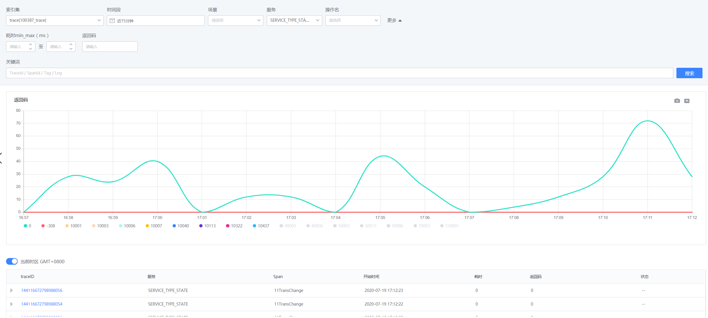
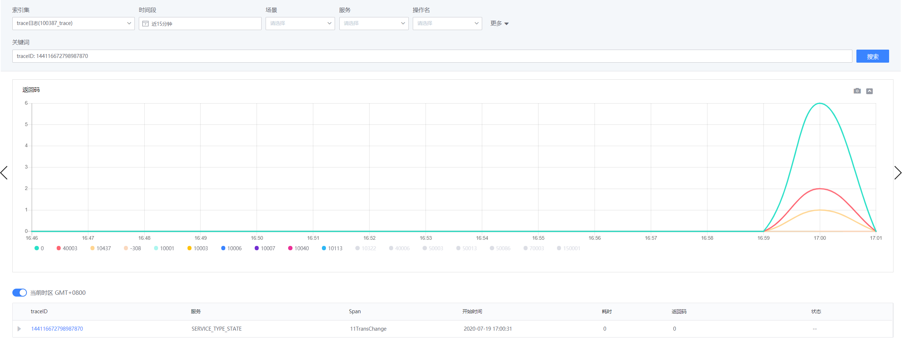
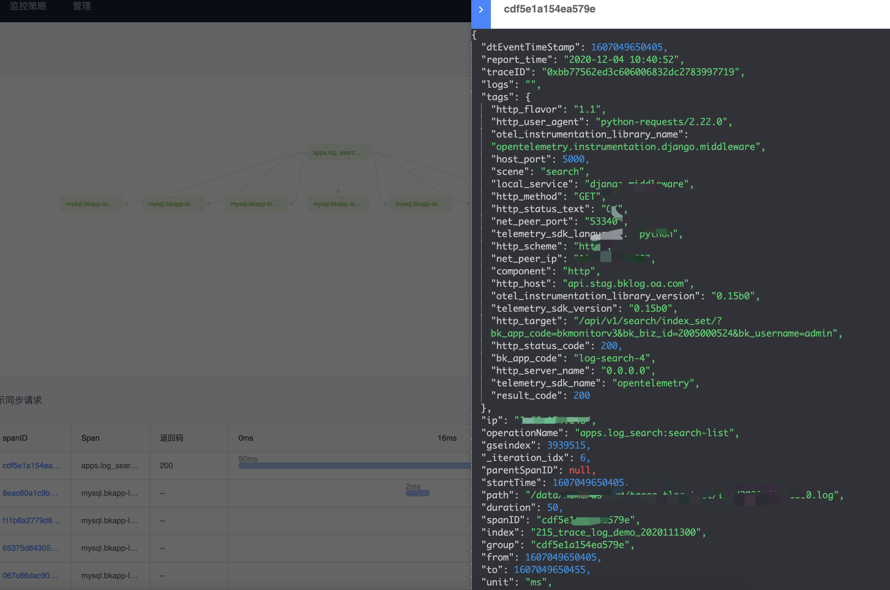

## 统计预览

检索首页可以便捷使用时间、耗时、场景、服务、操作名等查询条件进行过滤查找用户想要获取的信息。平台以耗时图、返回码等维度对结果进行统计分析。
当只有时间、场景为查询条件时，检索结果以trace维度进行聚合及统计；否则，结果以span维度进行统计及展示，两种方式结合，准确表达查询意图。目前系统默认按照场景/服务类别进行聚合统计（需在接入或者清洗时入库相关字段，详情见接入指引文档），后续会优化为按照用户接入时自定义字段进行聚合，满足用户多种多样需求。
按照返回码聚合：

按照服务场景进行聚合：

同时，用户也可以在搜索框输入具体信息，包括具体的traceid、spanid或者具体的错误日志等进行查询。

## Trace详情查询

通过检索获取到响应的trace后，点击traceID可以查询trace详情。
trace详情展示，按调用关系、耗时两个维度进行展示。

其中：
- 调用关系图显示各个节点(span)之间的调用关系：
    - 绿色节点为返回值正常节点，红色为异常节点
    - 带角标的节点表示其与父节点的关系为同步执行关系，否则为异步执行节点。
- 瀑布图展示节点的执行耗时，同时瀑布图增加“仅显示同步请求”开关，用来在调用关系复杂时，可以更准确的了解到关键路径的信息。

## 节点详情展示

点击具体节点后，会详细显示节点的具体内容，上下游IP，调用时间，耗时等信息均可详细展示：

